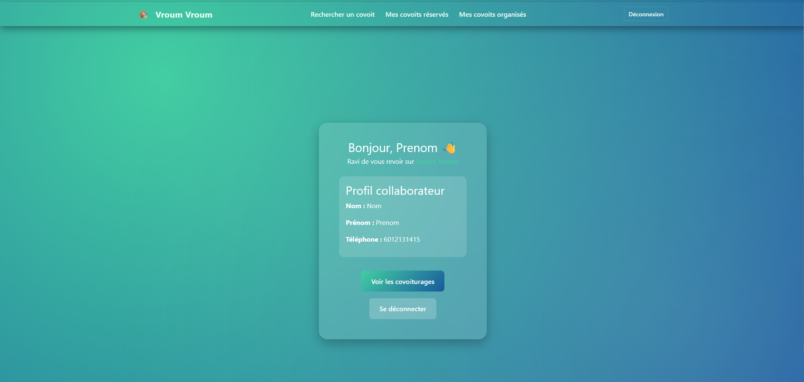
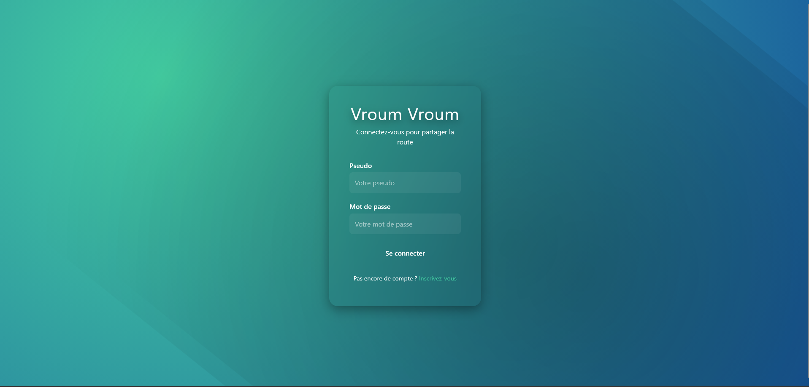

# Vroum vroum 🚗

## Sommaire
[A propos](#a-propos)\
[Stack technique](#stack-technique)\
[Collaborateurs](#collaborateurs)

## A propos

*Vroum vroum* est une application web de gestion des transports professionnels permettant à un utilisateur de :
- Réserver un véhicule de service pour un déplacement professionnel.
- D'organiser un covoiturage entre une adresse de départ et une adresse d'arrivée.
- De réserver une place dans un covoiturage existant.

L'application permet également aux administrateurs de gérer le parc de véhicules de service :
- Ajouter un véhicule de service.
- Modifier, entre autres informations, le statut d'un véhicule (disponible, en travaux, hors service).
- Supprimer un véhicule.

### Authentification
L'authentification se fait à l'aide d'un couple identifiant-mot de passe.

La création de nouveau profil utilisateur n'est pas autorisée. Seuls les administrateurs peuvent créer de nouveaux comptes pour les collaborateurs.

## Stack technique

- Backend :
    - Langage de programmation : [Java JDK 21](https://www.oracle.com/fr/java/technologies/downloads/)
    - Outil de build et de gestion de dépendances : [Apache Maven 3.9.9](https://maven.apache.org/)
    - ORM : [Hibernate 6.3.1](https://hibernate.org/)
- FrontEnd :
    - Framework JS : [Angular 19.0.7](https://angular.dev/installation)
    - Framework CSS : [Bootstrap 5.3.8](https://getbootstrap.com/)

## Collaborateurs
- [Johan Guillen](https://github.com/sioupe)
- [Loïc Mayran](https://github.com/MayranL)
- [Maxence Ogier](https://github.com/X3nc3)
- [Pauline Bouyssou](https://github.com/popobg)
